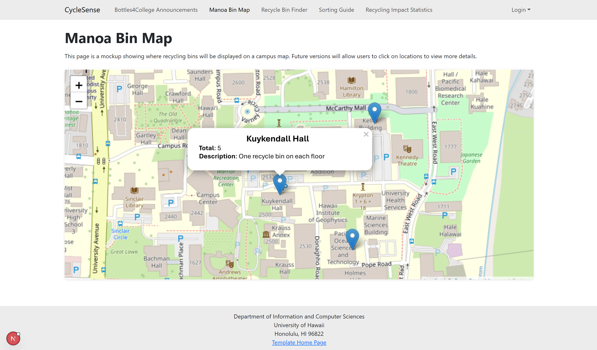
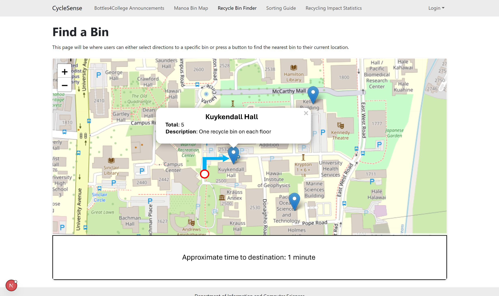
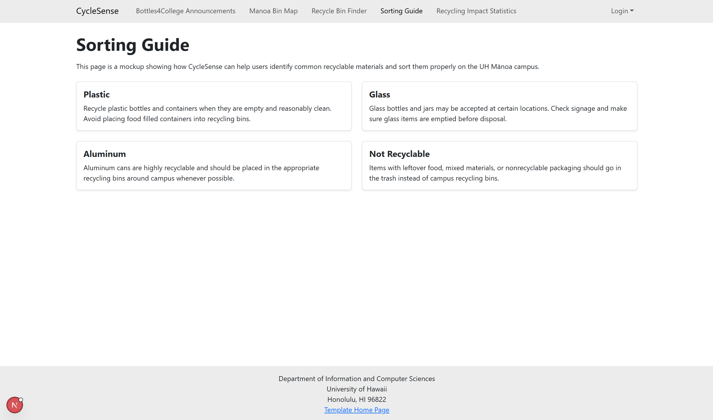
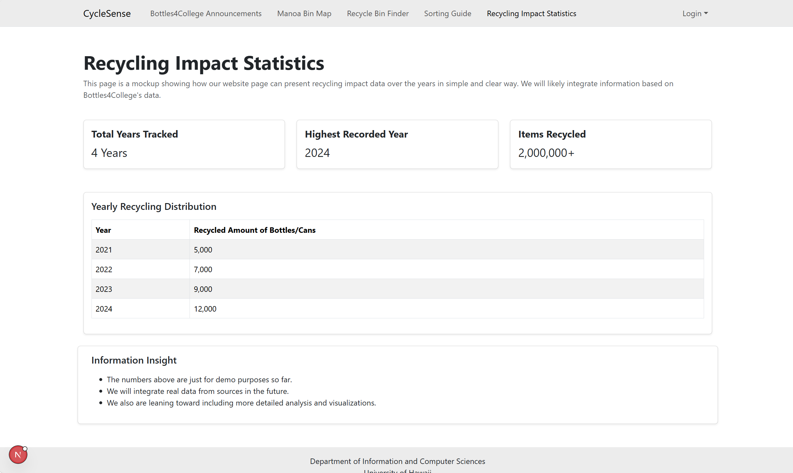

## Table of contents

* [Overview](#overview)
* [Deployment](#deployment)
* [User Guide](#user-guide)
* [Community Feedback](#community-feedback)
* [Developer Guide](#developer-guide)
* [Development History](#development-history)
* [Team](#team)

## Overview

Recycling has an emphasis in Hawai’i with the common saying “malama i ka ‘aina,” meaning to care for and protect the land. UH Manoa is a large campus, and albeit convenient to toss bottles/cans into trash bins, this does not effectively help with protecting the environment. The Cycle5ense application allows for users on campus to easily locate recyclable locations through a map and provides additional information about recycling on other pages.

* [GitHub Organization](https://github.com/cycle5ense) of Cycle5ense conatining all its repositories

## User Guide

This section provides a walkthrough of the Cycle5ense user interface.

### Landing Page

The landing page is presented to users when they visit the top-level URL to the site.

### Bottles4College Announcements

"Bottles4College is a multi-award winning 501(c)(3) nonprofit organization that collects recyclable cans and bottles to help protect the planet and help fund college scholarships for kids in Hawaii." This page lists announcements and events from the Bottles4College organization.

**Join us for our next event!**  
Join us for our upcoming beach cleanup on April 20 at Ala Moana Beach Park from 9:00 AM to 12:00 PM. Help us protect our environment by collecting recyclable bottles and cans while supporting a cleaner Hawaii.

### Map

The Map page will display the manoa campus with pins that indicate where recycle bins are located.

### Find Nearest Bin

The Find Nearest Bin page will direct users to the recycle bin closest to them.

### Sorting Guide

The Sorting Guide page displays information about what can and cannot be recycled.

### Recycling Impact Statistics

The Recycling Impact Statistics page will show real data about how many items are recycled per year, how much resources recycling has saved, etc.

## Community Feedback

We are interested in your experience using the Cycle5ense application!  If you would like, please take a couple of minutes to fill out the [Cycle5ense Feedback Form]().

Feedback we have received:
* Foo: "This is the very best website I have ever seen! 10/10 would recommend to anyone in UH!"

## Developer Guide

This section provides information of interest to developers wishing to use this code base as a basis for their own development tasks.

## Development History

The development process for Cycle5ense conformed to [Issue Driven Project Management](http://courses.ics.hawaii.edu/ics314f19/modules/project-management/) practices. In a nutshell:

* Development consists of a sequence of Milestones.
* Each Milestone is specified as a set of tasks.
* Each task is described using a GitHub Issue, and is assigned to a single developer to complete.
* Tasks should typically consist of work that can be completed in 2-4 days.
* The work for each task is accomplished with a git branch named "issue-XX", where XX is replaced by the issue number.
* When a task is complete, its corresponding issue is closed and its corresponding git branch is merged into master.
* The state (todo, in progress, complete) of each task for a milestone is managed using a GitHub Project Board.

The following sections document the development history of Cycle5ense.

### Milestone 1: Mockup development

The goal of Milestone 1 was to create a set of HTML pages providing a mockup of the pages in the system.

Milestone 1 was managed using [Cycle5ense GitHub Project Board M1](https://github.com/orgs/cycle5ense/projects/1):

## Team

[Team Contract](https://docs.google.com/document/d/1DC_14kH7sXwnWtqByaQi7bHruMDQrfc-3NLZaMm2dn0/edit?tab=t.0#heading=h.zi0hnn54eohk)

* [Au, Joshua](https://joshau124.github.io/)
* [Herradura, Riley](https://rileyherra.github.io/)
* [Lagazo, Julius](https://jslagazo.github.io/)
* [Knight, Danil](https://danilk09.github.io/)
* [Unger, Tyler](https://ungert.github.io/)